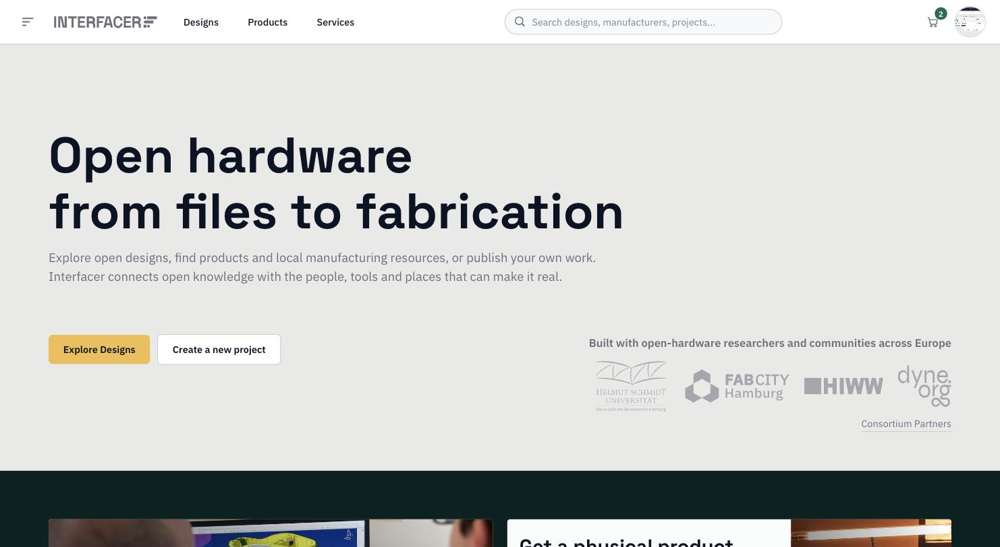
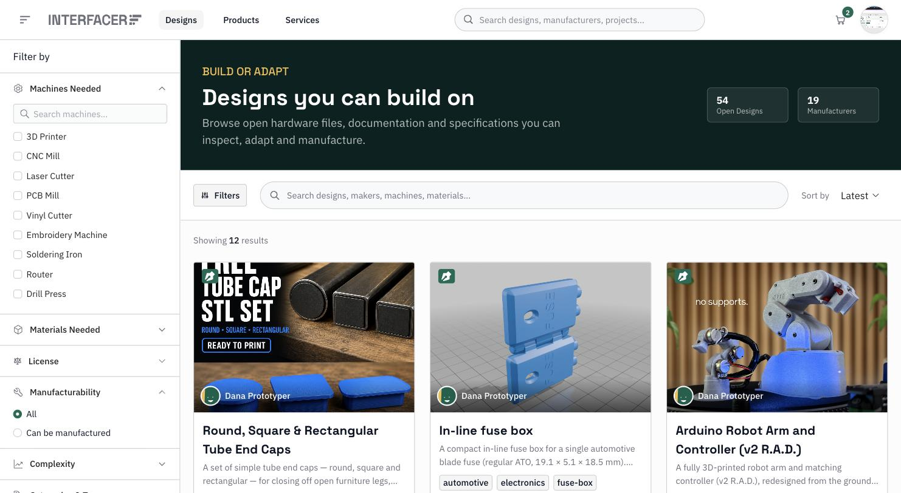
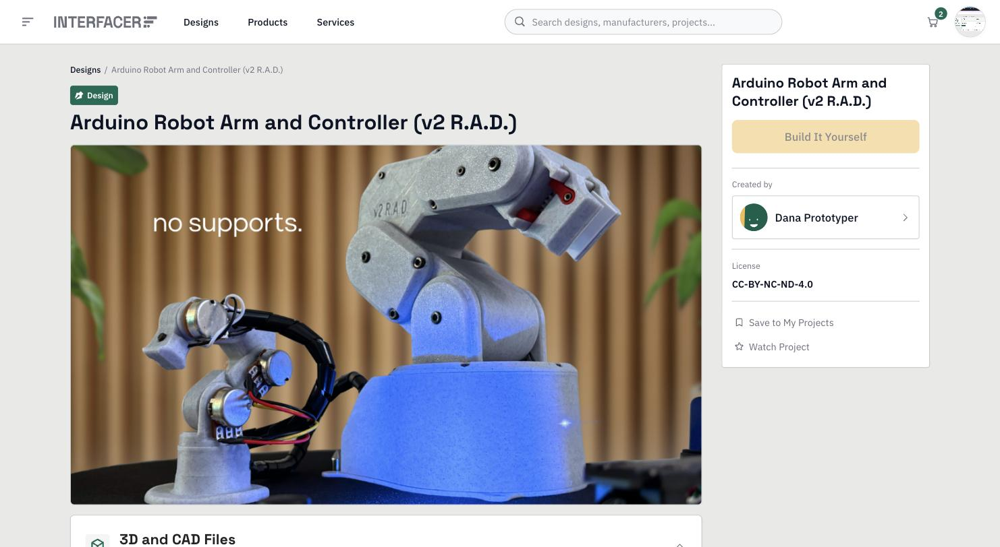
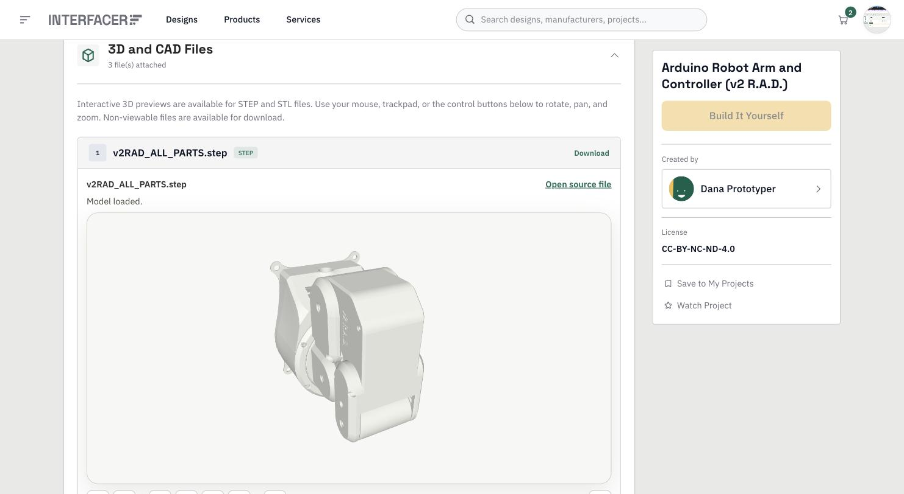
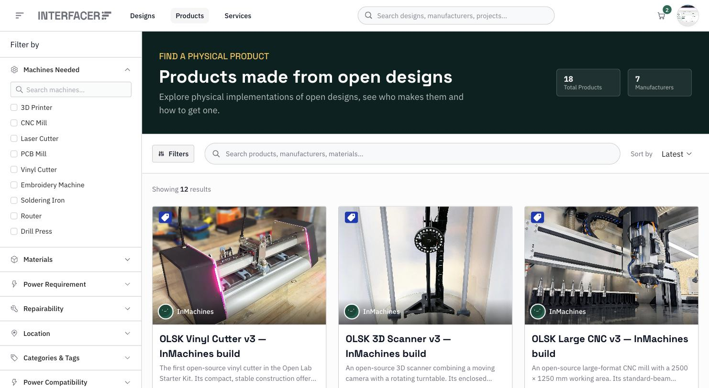
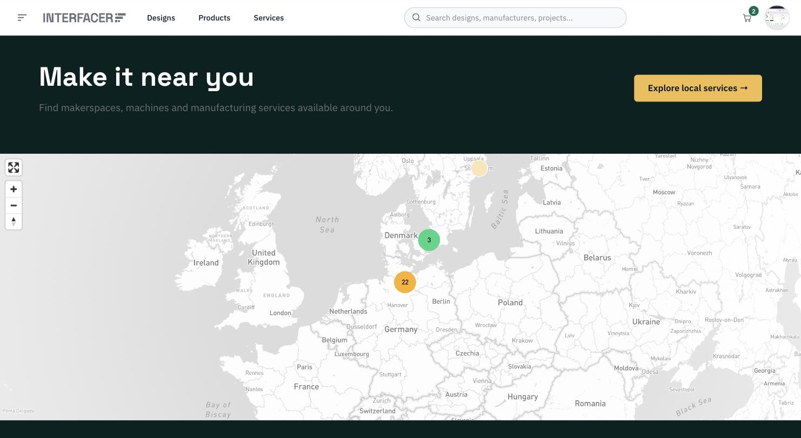

<!--
SPDX-License-Identifier: AGPL-3.0-or-later
Copyright (C) 2022-2023 Dyne.org foundation <foundation@dyne.org>.

This program is free software: you can redistribute it and/or modify
it under the terms of the GNU Affero General Public License as
published by the Free Software Foundation, either version 3 of the
License, or (at your option) any later version.

This program is distributed in the hope that it will be useful,
but WITHOUT ANY WARRANTY; without even the implied warranty of
MERCHANTABILITY or FITNESS FOR A PARTICULAR PURPOSE.  See the
GNU Affero General Public License for more details.

You should have received a copy of the GNU Affero General Public License
along with this program.  If not, see <https://www.gnu.org/licenses/>.
-->

<div align="center">

<picture>
  <source media="(prefers-color-scheme: dark)" srcset="public/IF-Logo-white.svg">
  <source media="(prefers-color-scheme: light)" srcset="public/IF-Logo-black.svg">
  
</picture>

# Open hardware, from files to fabrication

**Interfacer GUI** is the Progressive Web App that people use to explore open
hardware designs, find the products made from them, and discover the machines,
makerspaces and services that can build them locally.

[**🚀 Try the live demo**](https://interfacer.dyne.org/) &nbsp;·&nbsp;
[**📖 About the project**](https://www.interfacerproject.eu/) &nbsp;·&nbsp;
[**🐋 Container image**](https://github.com/interfacerproject/interfacer-gui/pkgs/container/interfacer-gui)

[](https://github.com/interfacerproject/interfacer-gui/actions/workflows/test-deploy.yml)
[](https://github.com/interfacerproject/interfacer-gui/actions/workflows/publish.yml)
[](LICENSES/AGPL-3.0-or-later.txt)
[](https://nextjs.org/)
[](https://www.typescriptlang.org/)



</div>

---

## Why it exists

Open hardware documentation is scattered. A design lives in one repository, the
person who can machine it lives in another city, and the physical object that
came out of it leaves no trail back to the files it was built from.

Interfacer closes that loop. It is the client for **FabCityOS**, a federated
platform for open hardware collaboration, and it connects three things that are
usually kept apart:

- **The design** — documentation, CAD files, licences and specifications.
- **The product** — the physical thing somebody actually manufactured from that design.
- **The capability** — the machines, materials, spaces and skills available near you.

Underneath, resources and the flows between them are tracked with
[ValueFlows](https://www.valueflo.ws/) economic accounting through a
[zenflows](https://github.com/interfacerproject/zenflows) backend, and each
account carries a cryptographic identity generated in the browser with
[Zenroom](https://zenroom.org/) — so participants keep their keys, their data
and their privacy.

**[🔝 back to top](#toc)**

---

## What you can do with it

### Browse open designs you can build on

Faceted search across every published design — filter by the machines you own,
the materials you can source, the licence you need, or how complex the build is.



### Read the full story of a design

Every project page collects its documentation, licence, contributors, location
and relations to other projects in one place.



### Inspect CAD files without downloading them

STEP and STL files render in an interactive 3D viewer right in the page — rotate,
pan and zoom before deciding whether the design is worth your filament.



### Find the physical products made from open designs

Each product links back to the design it was built from and the manufacturer who
built it.



### Make it near you

Makerspaces, machines and manufacturing services on a map, filterable by service
type, availability, equipment and distance.



Beyond the catalogs, the app also provides digital product passports (exportable
as PDF), project contribution and collaboration flows, notifications, QR
scanning, and a full interface in **English, German, French and Italian**.

**[🔝 back to top](#toc)**

---

<div align="center">

## Building the digital infrastructure for Fab Cities

<a href="https://www.interfacerproject.eu/">
  <picture>
    <source media="(prefers-color-scheme: dark)" srcset="public/IF-Logo-white.svg">
    <source media="(prefers-color-scheme: light)" srcset="https://dyne.org/images/projects/Interfacer_logo_color.png">
    
  </picture>
</a>

</div>

The goal of the INTERFACER project is to build the open-source digital
infrastructure for Fab Cities.

Our vision is to promote a green, resilient, and digitally-based mode of
production and consumption that enables the greatest possible sovereignty,
empowerment and participation of citizens all over the world. We want to help
Fab Cities to produce everything they consume by 2054 on the basis of
collaboratively developed and globally shared data in the commons.

To know more, [download the whitepaper](https://www.interfacerproject.eu/assets/news/whitepaper/IF-WhitePaper_DigitalInfrastructureForFabCities.pdf).

**[🔝 back to top](#toc)**

---

<div id="toc">

### 🚩 Table of Contents

- [🎮 Quick start](#-quick-start)
- [💾 Install](#-install)
- [🔧 Configuration](#-configuration)
- [🛠 Development](#-development)
- [📋 Testing](#-testing)
- [🔡 Translations](#-translations)
- [🐋 Docker](#-docker)
- [🐛 Troubleshooting & debugging](#-troubleshooting--debugging)
- [👤 Contributing](#-contributing)
- [😍 Acknowledgements](#-acknowledgements)
- [🌐 Links](#-links)
- [💼 License](#-license)

</div>

---

## 🎮 Quick start

The fastest way to see it running is the published container image:

```bash
docker run -it -p 3000:3000 ghcr.io/interfacerproject/interfacer-gui:main
```

Open [http://localhost:3000](http://localhost:3000). By default it talks to the
public staging backend, so you get a working instance with real data and no
setup.

**[🔝 back to top](#toc)**

---

## 💾 Install

**Prerequisites** — Node 24 and pnpm 9.13.1. Both versions are pinned in
[`.mise.toml`](.mise.toml), so if you use [mise](https://mise.jdx.dev/) a `mise
install` gets you the right ones. Otherwise, any Node 24 plus `corepack enable`
will do.

```bash
# optional: fetch the submodules CI also checks out —
# zenflows-crypto (Zenroom contracts), .reuse (licence templates)
# and components/interfacer-dpp. A plain build works without them:
# runtime crypto comes from the zenroom package and the
# @dyne/interfacer-client SDK, and DPPs are fetched over HTTP.
git submodule update --init

pnpm i

# copy and fill the env variables from the example provided
cp .env.example .env.local

# run with livereload and watch
pnpm dev

# or build & start it for faster execution
pnpm build
pnpm start
```

Open [http://localhost:3000](http://localhost:3000) with your browser to see the result.

`.env.example` points at the public staging gateway, so a fresh checkout runs
against a working backend without any credentials of your own.

**[🔝 back to top](#toc)**

---

## 🔧 Configuration

Default values live in [`.env.example`](.env.example). Copy it to `.env.local`
and adjust.

### Core

| Variable                           | What it does                                                 |
| ---------------------------------- | ------------------------------------------------------------ |
| `BASE_URL`                         | The federated instance gateway every service below hangs off |
| `DEEPL_API_KEY`                    | DeepL key used by the i18n module for auto-translation       |
| `NEXT_PUBLIC_LOSH_ID`              | The LUID designated as owner of the LOSH imported assets     |
| `NEXT_PUBLIC_ZENFLOWS_ADMIN`       | Admin key of the federated zenflows instance                 |
| `NEXT_PUBLIC_INVITATION_KEY`       | Invitation key needed to register new users                  |
| `NEXT_PUBLIC_MAPBOX_KEY`           | Mapbox token for the maps — without it, maps stay blank      |
| `NEXT_PUBLIC_DID_EXPLORER`         | DID explorer used to resolve decentralised identifiers       |
| `NEXT_PUBLIC_START_DATE`           | Start date of the first accounting cycle                     |
| `NEXT_PUBLIC_CYCLE_LENGTH`         | Length of an accounting cycle, in days                       |
| `NEXT_PUBLIC_INBOX_COUNT_INTERVAL` | How often, in ms, to poll for unread notifications           |

### Derived services

These are endpoints of the instance microservices and normally just follow `BASE_URL`:

```bash
NEXT_PUBLIC_ZENFLOWS_URL=$BASE_URL/zenflows/api
NEXT_PUBLIC_ZENFLOWS_FILE_URL=$BASE_URL/zenflows/api/file
NEXT_PUBLIC_DPP_URL=$BASE_URL/interfacer-dpp
NEXT_PUBLIC_LOCATION_AUTOCOMPLETE=$BASE_URL/location-autocomplete/
NEXT_PUBLIC_LOCATION_LOOKUP=$BASE_URL/location-lookup/
NEXT_PUBLIC_INBOX_SEND=$BASE_URL/inbox/send
NEXT_PUBLIC_INBOX_READ=$BASE_URL/inbox/read
NEXT_PUBLIC_INBOX_COUNT_UNREAD=$BASE_URL/inbox/count-unread
NEXT_PUBLIC_INBOX_SET_READ=$BASE_URL/inbox/set-read
NEXT_PUBLIC_WALLET=$BASE_URL/wallet/token
NEXT_PUBLIC_SOCIAL_PERSON=$BASE_URL/inbox/person
NEXT_PUBLIC_SOCIAL_ECONOMIC_RESOURCE=$BASE_URL/inbox/economicresource
NEXT_PUBLIC_OSH=$BASE_URL/osh
```

### Feature flags

| Flag                              | Default | What it does                                                                                                                                                                                                      |
| --------------------------------- | ------- | ----------------------------------------------------------------------------------------------------------------------------------------------------------------------------------------------------------------- |
| `NEXT_PUBLIC_FF_COMMERCE_PREVIEW` | `false` | Enables a **mock-up** of an upcoming MedusaJS integration (buy block, cart, checkout, seller dashboard). Nothing behind it is real: no Medusa, no payment provider, no writes to zenflows. Demo deployments only. |

**[🔝 back to top](#toc)**

---

## 🛠 Development

### Scripts

| Command               | What it does                            |
| --------------------- | --------------------------------------- |
| `pnpm dev`            | Dev server with livereload              |
| `pnpm build`          | Production build                        |
| `pnpm start`          | Serve the production build              |
| `pnpm lint`           | Lint via `next lint`                    |
| `pnpm fix-lint`       | Lint and autofix                        |
| `pnpm check-types`    | Type-check with `tsc --noEmit`          |
| `pnpm format`         | Format everything with Prettier         |
| `pnpm check-format`   | Check formatting without writing        |
| `pnpm test`           | Run the Playwright end-to-end suite     |
| `pnpm e2e:headless`   | Build, then run the suite               |
| `pnpm e2e`            | Build, then run it in a visible browser |
| `pnpm translate`      | Extract and auto-translate i18n strings |
| `pnpm types:generate` | Regenerate GraphQL types (see below)    |

### Project layout

```
pages/         Next.js routes (pages router) — catalogs, project & resource pages, auth
components/    UI, grouped by area: brickroom/ (design system), partials/, search/, layout/
lib/           Domain logic — GraphQL documents, DPP handling, licences, file upload
hooks/         Data-fetching and stateful React hooks
contexts/      Global React contexts (auth, user)
public/locales Translation catalogs for en, de, fr, it
tests/         Playwright end-to-end specs
```

The UI is built on [Polaris](https://polaris.shopify.com/) through the
[`@bbtgnn/polaris-interfacer`](https://github.com/bbtgnn/polaris-interfacer)
fork, with Tailwind for layout.

### 🐝 GraphQL API and generated types

The app talks to a [zenflows](https://github.com/interfacerproject/zenflows)
GraphQL endpoint, exposed at `NEXT_PUBLIC_ZENFLOWS_URL`. TypeScript types for
every query and mutation are generated from the live schema:

```bash
pnpm types:generate
```

This reads the schema configured in [`codegen.ts`](codegen.ts), scans the GraphQL
documents in `lib/`, `components/`, `pages/` and `contexts/`, and writes
`lib/types/index.ts`. Run it whenever you add or change a query — the generated
file is committed.

### Commits

`husky` runs a pre-commit hook that type-checks, lints and formats staged files,
and a commit-msg hook that lints your message with
[devmoji](https://github.com/folke/devmoji). Messages follow
[Conventional Commits](https://www.conventionalcommits.org/), which is where the
emoji in the git log come from:

```
feat(map): cluster nearby service providers
fix(project): keep licence badge visible on narrow screens
```

### Licence headers

This repository follows the [REUSE](https://reuse.software/) specification. Every
file carries an AGPL-3.0-or-later header, and binary files get a `.license`
sidecar next to them. Match the surrounding files when you add new ones.

**[🔝 back to top](#toc)**

---

## 📋 Testing

End-to-end tests are written with [Playwright](https://playwright.dev/) and live
in [`tests/`](tests).

```bash
# run the whole suite against an existing production build
pnpm test

# build first, then run — what you want from a clean checkout
pnpm e2e:headless

# same, but watch it happen in a browser
pnpm e2e

# run one spec
pnpm exec playwright test tests/authentication.spec.ts

# open the last HTML report
pnpm exec playwright show-report
```

Playwright starts the app itself: the `webServer` block in
[`playwright.config.js`](playwright.config.js) runs `pnpm start` and waits for
it, reusing a server you already have running outside CI. That's why `pnpm test`
needs a build to exist, and why `pnpm e2e:headless` makes one first.

Test accounts and keys come from [`playwright.env`](playwright.env).

CI runs the same suite on every push and pull request, and uploads the HTML
report as a build artifact — see
[`.github/workflows/test-deploy.yml`](.github/workflows/test-deploy.yml).

**[🔝 back to top](#toc)**

---

## 🔡 Translations

The interface ships in English, German, French and Italian. Catalogs live under
[`public/locales/`](public/locales), one directory per language.

```bash
pnpm translate
```

This extracts translatable strings from the source and fills in missing ones via
DeepL, which needs `DEEPL_API_KEY` set in your `.env.local`. Review what it
produces before committing — machine translation gets the gist, not the tone.

**[🔝 back to top](#toc)**

---

## 🐋 Docker

Images are published to the GitHub Container Registry on every push to `main`:

```bash
docker pull ghcr.io/interfacerproject/interfacer-gui:main
docker run -it -p 3000:3000 ghcr.io/interfacerproject/interfacer-gui:main
```

To point an instance at your own gateway, pass the environment at run time:

```bash
docker run -it -p 3000:3000 --env-file .env.local \
  ghcr.io/interfacerproject/interfacer-gui:main
```

Building locally works too, straight from the [`Dockerfile`](Dockerfile):

```bash
docker build -t interfacer-gui .
```

Next.js inlines `NEXT_PUBLIC_*` variables at build time, and this image runs
`pnpm build` on container start — so the environment you pass at `docker run`
does take effect, at the cost of a build on every boot. Moving that to a runtime
config is a known [TODO in the Dockerfile](Dockerfile).

**[🔝 back to top](#toc)**

---

## 🐛 Troubleshooting & debugging

**Maps are blank.** `NEXT_PUBLIC_MAPBOX_KEY` is empty in `.env.example` — supply
your own Mapbox token.

**GraphQL errors after pulling.** The schema may have moved. Re-run
`pnpm types:generate` and rebuild.

**Type errors on commit.** The pre-commit hook runs `pnpm check-types` across the
whole project, so an error somewhere else in the tree will block your commit.

Known bugs are on the [Issues page](../../issues).

**[🔝 back to top](#toc)**

---

## 👤 Contributing

1. 🔀 [FORK IT](../../fork)
2. Create your feature branch `git checkout -b feature/branch`
3. Commit your changes `git commit -am 'feat: add some fooBar'`
4. Push to the branch `git push origin feature/branch`
5. Create a new Pull Request
6. 🙏 Thank you

Before opening the PR, run `pnpm check-types`, `pnpm lint` and `pnpm test` —
they're the same gates CI applies.

**[🔝 back to top](#toc)**

---

## 😍 Acknowledgements

<a href="https://dyne.org">
  
</a>

Copyleft (ɔ) 2022 by [Dyne.org](https://www.dyne.org) foundation, Amsterdam

Designed, written and maintained by Ennio Donato, Micol Salomone, Giovanni
Abbatepaolo and Puria Nafisi Azizi.

Built together with the INTERFACER consortium: Helmut Schmidt Universität, Fab
City Hamburg, HIWW and Dyne.org.

**[🔝 back to top](#toc)**

---

## 🌐 Links

- [Interfacer project](https://www.interfacerproject.eu/)
- [Live demo](https://interfacer.dyne.org/)
- [Dyne.org](https://dyne.org/)
- [zenflows backend](https://github.com/interfacerproject/zenflows)
- [ValueFlows vocabulary](https://www.valueflo.ws/)
- [Zenroom](https://zenroom.org/)

**[🔝 back to top](#toc)**

---

## 💼 License

    Interfacer GUI - Interfacer's Progressive Web App client
    Copyleft (ɔ) 2022 Dyne.org foundation

    This program is free software: you can redistribute it and/or modify
    it under the terms of the GNU Affero General Public License as
    published by the Free Software Foundation, either version 3 of the
    License, or (at your option) any later version.

    This program is distributed in the hope that it will be useful,
    but WITHOUT ANY WARRANTY; without even the implied warranty of
    MERCHANTABILITY or FITNESS FOR A PARTICULAR PURPOSE.  See the
    GNU Affero General Public License for more details.

    You should have received a copy of the GNU Affero General Public License
    along with this program.  If not, see <http://www.gnu.org/licenses/>.

**[🔝 back to top](#toc)**
